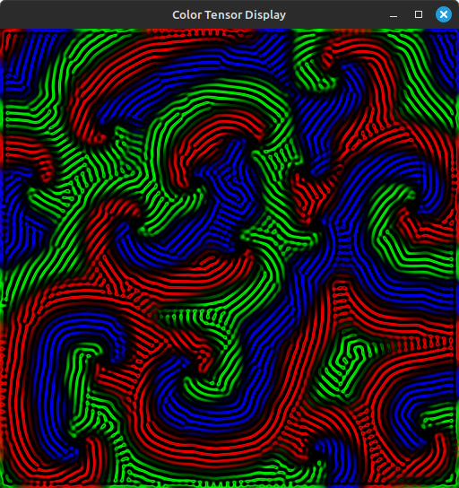

# TorchImager

TorchImager is a lightweight library for visualizing 2D tensors directly from PyTorch using OpenGL and HIP/CUDA interop. It supports both grayscale and color images. TorchImager is designed to be simple to use while being performant by displaying tensors directly on the GPU without transferring data back to the CPU.

**Note**: TorchImager is in its early alpha stage and is under active development. Some stability issues might happen out of the tested use cases.

<p align="center">
    
    
    
    
</p>

## Features

- Display 2D tensors in **grayscale** and **color**.
- Use **PyTorch** to handle tensors on the GPU.
- Direct visualization on the GPU (no CPU transfer).
- Support for window scaling.

## Installation

TorchImager is available on PyPI and can be installed via:

```bash
pip install TorchImager
```

## Requirements

- ROCm/HIP
- OpenGL
- GLFW3
- GLEW

## Usage Examples

### Example 1: Display a Grayscale Tensor

```python
import torch
from TorchImager import Window

height, width = 512, 512
tensor = torch.rand(height, width)

with Window(width, height, "grayscale", 1) as window:
    window.show(tensor)
```

### Example 2: Display a Color Tensor

```python
import torch
from TorchImager import Window

height, width = 512, 512
tensor = torch.rand(3, height, width)

with Window(width, height, "color", 0.5) as window:
    window.show(tensor)
```

### Example 3: Continuously Update a Grayscale Tensor

```python
import torch
from TorchImager import Window

height, width = 512, 512

try:
    with Window(width, height, "grayscale", 2) as window:
        while True:
            tensor = torch.rand(height, width)
            window.update(tensor)

except KeyboardInterrupt:
    print("\nWindow closed by user.")
```

## Current Limitations

TorchImager is in **alpha** and has some significant limitations:

- **Linux only**: The library currently works only on Linux.
- **One window at a time**: Currently, only one display window can be open at a time.

We are actively working on addressing these limitations and plan to:

- Add support for **multi-platform** (Windows, Mac).
- Enable **multiple windows** at the same time.
- Optimize resource usage and window management.

## Roadmap

Here's a quick overview of our priorities for future development:

### Issues

- Prevent memory leaks from happening when opening multiple windows at the same time
- Find the cause of the `segmentation fault (core dumped)` error when opening multiple windows in a row
- Investigate the white lines appearing when using large window sizes in the Lenia example

### Improvements

- Add Windows support

- Add the possibility to export tensors as images or record their state as a video
- Add the possibility to show values as text over the image

## How to Contribute

We welcome contributions from the community! If you'd like to help with any of the improvements or fixes mentioned in the roadmap, feel free to fork the repository and submit a pull request.

## License

This project is licensed under the MIT License. See the LICENSE file for details.